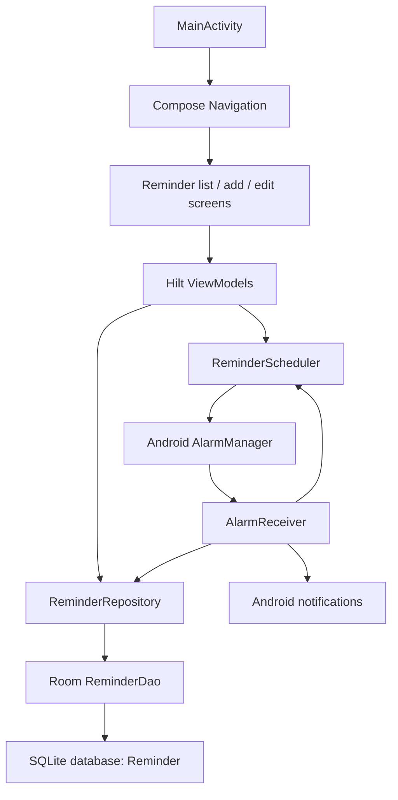

# Easy Reminder technical guide

## 1. Project overview

Easy Reminder is a single-module Android application for creating local, one-time reminders. It stores reminders in Room, renders the UI with Jetpack Compose, and uses `AlarmManager` plus a `BroadcastReceiver` to publish notifications.

Current application configuration:

| Setting | Value |
| --- | --- |
| Application ID | `rek.remindme.v2` |
| Namespace | `rek.remindme` |
| Minimum SDK | 23 |
| Compile/target SDK | 36 |
| Java toolchain | 21 |
| Kotlin | 2.2.0 |
| Gradle | 8.14.3 |
| Android Gradle Plugin | 8.12.0 |
| Version | 2.1.2 (`versionCode` 25) |

The user interface is localized in English and French.

## 2. Architecture

The application follows a compact MVVM structure:



There is one production module, `app`. The main packages are:

| Package | Responsibility |
| --- | --- |
| `rek.remindme` | Application class and Hilt bootstrap |
| `rek.remindme.common` | Alarm delivery, scheduling, date/time formatting, shared constants |
| `rek.remindme.data` | Repository abstraction and implementation |
| `rek.remindme.data.local.database` | Room entity, DAO, and database |
| `rek.remindme.data.di` | Repository dependency injection and the instrumented-test fake |
| `rek.remindme.data.local.di` | Room dependency injection |
| `rek.remindme.ui` | Activity and navigation graph |
| `rek.remindme.ui.reminder` | Reminder screens, ViewModels, validation, UI state |
| `rek.remindme.ui.components` | Reusable Compose components |
| `rek.remindme.ui.theme` | Material 3 theme |

## 3. Runtime behavior

### Application startup

`EasyReminder` is the Hilt application class. `MainActivity` enables edge-to-edge rendering, applies the Material theme, and starts `MainNavigation`.

The navigation graph has three destinations:

- `list?messageRes={messageRes}`: reminder list and optional snackbar result.
- `add`: create a reminder.
- `edit/{reminderId}`: edit an existing reminder.

Save and delete operations navigate back to the list with a string resource ID. The list displays that resource as a snackbar.

### Reminder list

`ReminderListViewModel` observes `ReminderRepository.reminders` as a `StateFlow<ReminderUiState>`. Room emits changes automatically.

The DAO returns reminders in two groups:

1. Future reminders, ordered by timestamp ascending and title ascending.
2. Past reminders, ordered by timestamp descending and title ascending.

Past reminders are visually muted. The list can clear old reminders after confirmation. “Old” is defined by a timestamp in the past, not by the `notified` column.

On Android 13 and newer, the list is covered by a permission prompt until notification permission is granted.

### Create and edit

`ReminderUpsertViewModel` owns the editable form state.

- A missing `reminderId` means create mode.
- A present `reminderId` loads the entity from Room and enables update mode.
- The title is limited to 50 characters.
- The description is limited to 200 characters.
- Title, date, hour, and minute are mandatory.
- The final date/time must be later than the current time.
- Saving always resets `notified` to `false`.

Dates and times use the device locale and time zone. Timestamps are stored as Unix epoch milliseconds.

### Alarm and notification flow

The app maintains a single alarm for the closest future reminder:

1. A reminder is created, updated, or deleted.
2. The relevant screen asks its ViewModel to find the closest pending reminder.
3. `ReminderScheduler` schedules an exact `RTC_WAKEUP` alarm.
4. `AlarmReceiver` receives the app-specific alarm action.
5. The receiver queries every due reminder whose `notified` flag is false.
6. It posts one notification per reminder and marks each delivered reminder as notified.
7. It schedules the next future reminder.

The receiver also listens for `BOOT_COMPLETED`. Debug and instrumented-test manifests remove the receiver to prevent real alarm behavior during development tests.

Important platform behavior:

- Android 13+ requires runtime notification permission.
- Android 12+ scheduling is attempted only when `AlarmManager.canScheduleExactAlarms()` is true.
- The scheduler currently fails silently when exact alarms are unavailable.
- On boot, the receiver returns early when no reminder is already due. Consequently, it does not reschedule a future reminder in that branch.
- A single `PendingIntent` request code (`0`) is intentionally reused, so each schedule replaces the previous alarm.

## 4. Persistence

Room database:

- Database class: `AppDatabase`
- Database file: `Reminder`
- Schema version: 1
- Entity table: `Reminder`
- Exported schema: `app/schemas/rek.remindme.data.local.database.AppDatabase/1.json`

Entity fields:

| Field | Type | Meaning |
| --- | --- | --- |
| `uid` | `Int` | Auto-generated primary key |
| `title` | `String` | Required reminder title |
| `description` | `String` | Optional reminder details |
| `unixTimestamp` | `Long` | Trigger time in epoch milliseconds |
| `notified` | `Boolean` | Whether a notification was posted |

`DefaultReminderRepository` is deliberately thin and delegates persistence operations to `ReminderDao`. Hilt binds it to `ReminderRepository` as a singleton.

When changing the entity or DAO schema:

1. Increase the Room database version.
2. Add a migration or an auto-migration.
3. Regenerate and commit the Room schema JSON.
4. Add migration/query tests.
5. Verify upgrade behavior without destructive migration.

## 5. Dependency injection

Hilt is initialized by `EasyReminder`.

- `DatabaseModule` creates the singleton Room database and provides `ReminderDao`.
- `DataModule` binds `DefaultReminderRepository` to `ReminderRepository`.
- `ReminderListViewModel` and `ReminderUpsertViewModel` use constructor injection.
- `AlarmReceiver` uses field injection because Android creates the receiver.

Instrumented tests use `HiltTestRunner` and replace `DataModule` with `FakeDataModule`. The fake repository starts with one notified reminder so list, clear, edit, and delete workflows have deterministic initial data.

## 6. Build and run

Prerequisites:

- JDK 21.
- Android Studio or command-line Android SDK tools.
- Android SDK Platform 36 and compatible build tools.
- `local.properties` containing a valid `sdk.dir`.

Windows:

```powershell
.\gradlew.bat assembleDebug
.\gradlew.bat installDebug
```

macOS/Linux:

```bash
./gradlew assembleDebug
./gradlew installDebug
```

The debug APK is generated under `app/build/outputs/apk/debug/`.

The release build enables code shrinking and resource shrinking. Release signing is not configured in the repository.

## 7. Tests and quality checks

### Local unit tests

```powershell
.\gradlew.bat testDebugUnitTest
```

The local suite covers:

- Date/time formatting in US English and French.
- Date/time field extraction and composition.
- Reminder validation.
- Description formatting.
- Repository upsert ID behavior.

The date/time tests set the default locale and time zone. New tests that depend on either should do the same and avoid leaking modified global state into unrelated tests.

### Instrumented tests

Start an emulator or connect a device, then run:

```powershell
.\gradlew.bat connectedDebugAndroidTest
```

The instrumented suite covers Compose rendering, validation errors, cancel paths, and the complete create/update/delete workflow. Stable semantic selectors are centralized in `Consts.TestTag`; preserve them when changing UI structure.

CI runs instrumented tests on an API 35 Google APIs x86_64 emulator with animations disabled.

### Coverage

```powershell
.\gradlew.bat jacocoTestReport
.\gradlew.bat jacocoTestDebugReport
.\gradlew.bat jacocoCombinedReport
```

- `jacocoTestReport` runs local tests and creates unit-test coverage.
- `jacocoTestDebugReport` runs connected instrumented tests and creates device coverage.
- `jacocoCombinedReport` combines existing unit and instrumented execution data.

Reports are written below `app/build/reports/jacoco/`.

### Full verification

With an emulator available:

```powershell
.\gradlew.bat testDebugUnitTest connectedDebugAndroidTest jacocoCombinedReport build
```

Without an emulator:

```powershell
.\gradlew.bat testDebugUnitTest assembleDebug
```

## 8. Continuous integration

`.github/workflows/build.yml` runs for pushes to `main` and pull requests.

The workflow:

1. Uses JDK 21.
2. Runs local unit tests and unit coverage.
3. Starts an API 35 emulator.
4. Runs instrumented tests and device coverage.
5. Builds the combined JaCoCo report.
6. Runs the Gradle build and SonarCloud analysis.

SonarCloud configuration lives in `app/build.gradle.kts`.

## 9. Resources and localization

English strings are in `app/src/main/res/values/strings.xml`; French strings are in `app/src/main/res/values-fr/strings.xml`.

For user-visible text:

- Add a named string resource instead of embedding text in Kotlin.
- Update both locales in the same change.
- Keep content descriptions meaningful for accessibility.
- Check instrumented tests for exact localized text assertions.

Launcher icons and notification/vector assets live in the normal Android resource directories.

## 10. Known constraints and maintenance notes

- `SimpleDeleteSwipe` is retained but not used because swipe-to-dismiss can conflict with vertical scrolling.
- `AlarmReceiver` uses a `goAsync` helper backed by `GlobalScope` because a receiver has no lifecycle teardown callback. Changes here require careful testing of `PendingResult.finish()`.
- Exact-alarm denial is not surfaced to the user.
- Boot rescheduling has the early-return behavior described in the alarm section.
- Backup/data-extraction XML files still contain template defaults; database backup behavior has not been explicitly designed.
- The fake repository implements only the operations required by current instrumented tests. Notification-delivery operations throw `NotImplementedError`.
- Date/time helpers rely on process-wide locale and time-zone defaults.

Treat these as explicit constraints when modifying scheduling, lifecycle, tests, or persistence.
